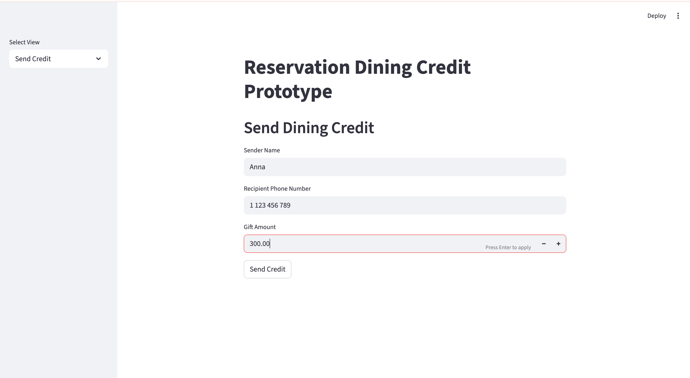

# Reservation Dining Credit Prototype
## Problem
Restaurants often receive requests from customers who want to prepay for someone else's dinner (for example, buying wine for their parents' reservation). Most restaurants only allow gift cards, which requires manual coordination with staff.
## Idea
Create a system where a dining credit can be attached to a diner’s account using their phone number. The credit stays with the diner even if the reservation changes.
## Prototype Demo
The prototype simulates three user flows:
1. Sender sending a dining credit
2. Recipient viewing their wallet
3. Restaurant host checking available credits
## Features
- Send dining credit to a phone number
- Attach credit to diner account
- Restaurant host can see available credit
- Credit applies to bill
## Tech Stack
Python  
Streamlit  
Pandas
## Author
Anna Huynh
UC Berkeley — Data Science

## Demo image

